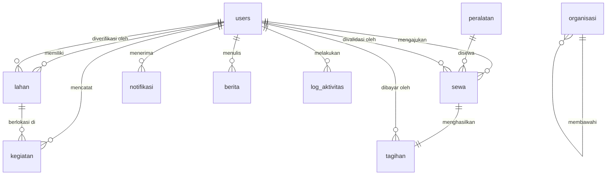
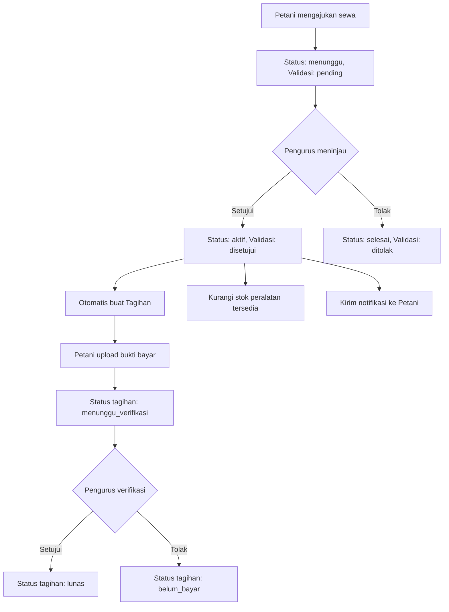
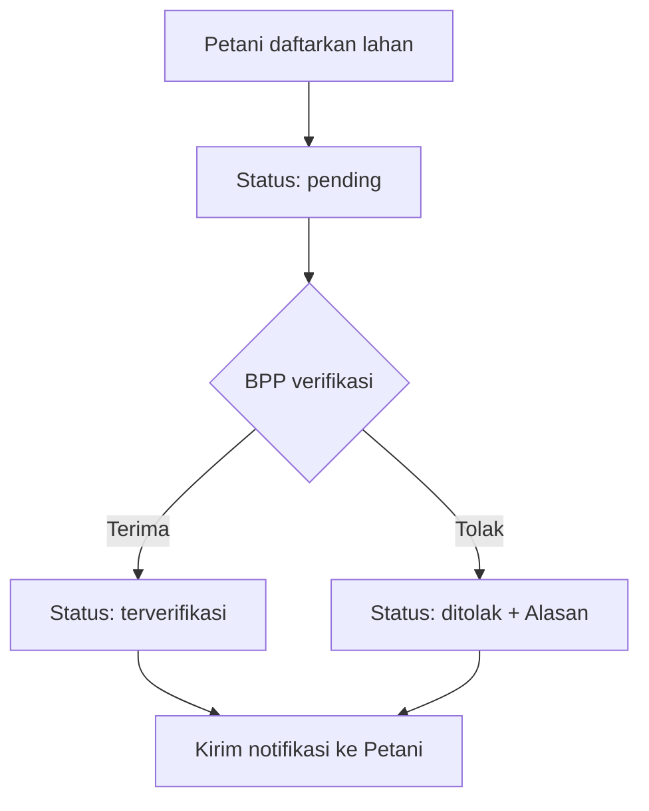

# 📋 PRD — Backend & Database SIMANTAN
## Sistem Manajemen Lahan & Sewa Peralatan Pertanian
### Portal Pertanian Pemerintah Kota — Sistem Tani

---

| Informasi | Detail |
|---|---|
| **Nama Proyek** | SIMANTAN (Sistem Manajemen Tani) |
| **Versi Dokumen** | 1.0 |
| **Tanggal** | 1 Juli 2026 |
| **Teknologi Backend** | Laravel 11 (PHP 8.2+) |
| **Teknologi Database** | MySQL 8.0+ / PostgreSQL 15+ |
| **Autentikasi** | Laravel Sanctum (Token-Based API) |
| **Frontend** | React + Vite (sudah ada) |

---

## 1. Ringkasan Proyek

SIMANTAN adalah sistem informasi kelompok tani berbasis web yang mengelola **data lahan pertanian**, **sewa peralatan**, **pembayaran**, **kegiatan petani**, dan **berita/penyuluhan**. Saat ini frontend (React) sudah dibangun lengkap menggunakan **mock data statis**. Dokumen PRD ini mendefinisikan kebutuhan **database** dan **backend API (Laravel)** untuk menggantikan mock data dengan data real yang persisten.

### 1.1. Tujuan
- Membangun REST API menggunakan Laravel yang melayani seluruh kebutuhan data frontend
- Merancang skema database relasional yang menampung seluruh entitas bisnis
- Menerapkan autentikasi berbasis token (Sanctum) dan otorisasi berbasis peran (role)
- Menyediakan file upload untuk bukti pembayaran dan foto kegiatan
- Mencatat log aktivitas sistem secara otomatis

### 1.2. Pengguna Sistem (Roles)

| Role | Deskripsi | Hak Akses Utama |
|---|---|---|
| **Petani** | Anggota kelompok tani | Kelola lahan sendiri, ajukan sewa, bayar tagihan, catat kegiatan, baca berita |
| **Pengurus** | Pengurus kelompok tani | Kelola semua lahan, kelola peralatan, validasi sewa, verifikasi pembayaran, lihat berita |
| **BPP** | Balai Penyuluhan Pertanian | Verifikasi lahan, kelola berita/penyuluhan, analisis data, notifikasi petani |
| **Admin** | Superadmin sistem | Kelola akun pengguna, lihat log aktivitas, backup & restore database |

---

## 2. Desain Database (ERD)

### 2.1. Entity Relationship Diagram



---

### 2.2. Detail Tabel

#### 2.2.1. `users` — Pengguna Sistem

| Kolom | Tipe | Constraint | Keterangan |
|---|---|---|---|
| `id` | BIGINT UNSIGNED | PK, AUTO_INCREMENT | |
| `nama` | VARCHAR(100) | NOT NULL | Nama lengkap pengguna |
| `email` | VARCHAR(150) | UNIQUE, NOT NULL | Digunakan untuk login |
| `password` | VARCHAR(255) | NOT NULL | Hash (bcrypt via Laravel) |
| `role` | ENUM('petani','pengurus','bpp','admin') | NOT NULL, DEFAULT 'petani' | Peran dalam sistem |
| `avatar` | VARCHAR(255) | NULLABLE | Path file foto profil |
| `status` | ENUM('aktif','nonaktif') | NOT NULL, DEFAULT 'aktif' | Status akun |
| `last_login_at` | TIMESTAMP | NULLABLE | Waktu login terakhir |
| `email_verified_at` | TIMESTAMP | NULLABLE | Waktu verifikasi email |
| `remember_token` | VARCHAR(100) | NULLABLE | Token remember me |
| `created_at` | TIMESTAMP | NOT NULL | |
| `updated_at` | TIMESTAMP | NOT NULL | |

**Index**: `email` (unique), `role`, `status`

---

#### 2.2.2. `lahan` — Data Lahan Pertanian

| Kolom | Tipe | Constraint | Keterangan |
|---|---|---|---|
| `id` | BIGINT UNSIGNED | PK, AUTO_INCREMENT | |
| `pemilik_id` | BIGINT UNSIGNED | FK → `users.id`, NOT NULL | Petani pemilik lahan |
| `lokasi` | VARCHAR(255) | NOT NULL | Alamat lengkap lahan (Desa, Kecamatan) |
| `luas` | DECIMAL(8,2) | NOT NULL | Luas lahan dalam Hektar |
| `jenis_lahan` | ENUM('Sawah','Tegalan','Perkebunan','Kolam','Ladang') | NOT NULL | Tipe penggunaan lahan |
| `status_verifikasi` | ENUM('pending','terverifikasi','ditolak') | NOT NULL, DEFAULT 'pending' | Status verifikasi oleh BPP |
| `koordinat` | VARCHAR(50) | NULLABLE | Latitude, Longitude |
| `tanggal_daftar` | DATE | NOT NULL | Tanggal pendaftaran lahan |
| `verifikator_id` | BIGINT UNSIGNED | FK → `users.id`, NULLABLE | BPP yang memverifikasi |
| `tanggal_verifikasi` | TIMESTAMP | NULLABLE | Waktu verifikasi dilakukan |
| `catatan` | TEXT | NULLABLE | Catatan tambahan |
| `alasan_ditolak` | TEXT | NULLABLE | Alasan jika ditolak BPP |
| `created_at` | TIMESTAMP | NOT NULL | |
| `updated_at` | TIMESTAMP | NOT NULL | |

**Index**: `pemilik_id`, `status_verifikasi`, `jenis_lahan`, `verifikator_id`

---

#### 2.2.3. `peralatan` — Inventaris Peralatan Pertanian

| Kolom | Tipe | Constraint | Keterangan |
|---|---|---|---|
| `id` | BIGINT UNSIGNED | PK, AUTO_INCREMENT | |
| `nama` | VARCHAR(150) | NOT NULL | Nama peralatan |
| `kategori` | ENUM('Pengolah Tanah','Penyemprotan','Panen','Irigasi','Perawatan','Teknologi') | NOT NULL | Kategori alat |
| `deskripsi` | TEXT | NULLABLE | Deskripsi spesifikasi alat |
| `harga_per_hari` | INTEGER UNSIGNED | NOT NULL | Tarif sewa per hari (Rupiah) |
| `stok` | SMALLINT UNSIGNED | NOT NULL, DEFAULT 0 | Total unit yang dimiliki |
| `tersedia` | SMALLINT UNSIGNED | NOT NULL, DEFAULT 0 | Jumlah unit tersedia saat ini |
| `gambar` | VARCHAR(255) | NULLABLE | Path file gambar peralatan |
| `kondisi` | ENUM('Baik','Cukup Baik','Perlu Perbaikan','Rusak') | NOT NULL, DEFAULT 'Baik' | Kondisi fisik alat |
| `created_at` | TIMESTAMP | NOT NULL | |
| `updated_at` | TIMESTAMP | NOT NULL | |

**Index**: `kategori`, `kondisi`

---

#### 2.2.4. `sewa` — Transaksi Sewa Peralatan

| Kolom | Tipe | Constraint | Keterangan |
|---|---|---|---|
| `id` | BIGINT UNSIGNED | PK, AUTO_INCREMENT | |
| `kode_sewa` | VARCHAR(20) | UNIQUE, NOT NULL | Kode unik (format: `SW-YYYY-NNN`) |
| `petani_id` | BIGINT UNSIGNED | FK → `users.id`, NOT NULL | Petani yang menyewa |
| `peralatan_id` | BIGINT UNSIGNED | FK → `peralatan.id`, NOT NULL | Peralatan yang disewa |
| `tanggal_mulai` | DATE | NOT NULL | Tanggal mulai sewa |
| `tanggal_selesai` | DATE | NOT NULL | Tanggal akhir sewa |
| `durasi` | SMALLINT UNSIGNED | NOT NULL | Jumlah hari sewa (computed) |
| `total_biaya` | INTEGER UNSIGNED | NOT NULL | Total biaya sewa (Rupiah) |
| `status` | ENUM('menunggu','aktif','selesai','dibatalkan') | NOT NULL, DEFAULT 'menunggu' | Status sewa saat ini |
| `validasi` | ENUM('pending','disetujui','ditolak') | NOT NULL, DEFAULT 'pending' | Status validasi pengurus |
| `validasi_oleh` | BIGINT UNSIGNED | FK → `users.id`, NULLABLE | Pengurus yang memvalidasi |
| `tanggal_validasi` | TIMESTAMP | NULLABLE | Waktu validasi dilakukan |
| `catatan` | TEXT | NULLABLE | Catatan dari petani |
| `created_at` | TIMESTAMP | NOT NULL | |
| `updated_at` | TIMESTAMP | NOT NULL | |

**Index**: `kode_sewa` (unique), `petani_id`, `peralatan_id`, `status`, `validasi`

---

#### 2.2.5. `tagihan` — Tagihan Pembayaran Sewa

| Kolom | Tipe | Constraint | Keterangan |
|---|---|---|---|
| `id` | BIGINT UNSIGNED | PK, AUTO_INCREMENT | |
| `kode_tagihan` | VARCHAR(20) | UNIQUE, NOT NULL | Kode unik (format: `TG-YYYY-NNN`) |
| `sewa_id` | BIGINT UNSIGNED | FK → `sewa.id`, NOT NULL | Referensi ke transaksi sewa |
| `petani_id` | BIGINT UNSIGNED | FK → `users.id`, NOT NULL | Petani yang ditag |
| `jumlah` | INTEGER UNSIGNED | NOT NULL | Nominal tagihan (Rupiah) |
| `tanggal_tagihan` | DATE | NOT NULL | Tanggal tagihan dibuat |
| `jatuh_tempo` | DATE | NOT NULL | Batas waktu pembayaran |
| `status` | ENUM('belum_bayar','menunggu_verifikasi','lunas') | NOT NULL, DEFAULT 'belum_bayar' | Status pembayaran |
| `tanggal_bayar` | DATE | NULLABLE | Tanggal pembayaran dilakukan |
| `bukti_pembayaran` | VARCHAR(255) | NULLABLE | Path file bukti bayar (JPG/PNG/PDF) |
| `jumlah_dibayar` | INTEGER UNSIGNED | NULLABLE | Nominal yang dibayarkan |
| `catatan_pembayaran` | TEXT | NULLABLE | Catatan dari petani saat upload |
| `verifikasi_oleh` | BIGINT UNSIGNED | FK → `users.id`, NULLABLE | Pengurus yang memverifikasi |
| `tanggal_verifikasi` | TIMESTAMP | NULLABLE | Waktu verifikasi pembayaran |
| `created_at` | TIMESTAMP | NOT NULL | |
| `updated_at` | TIMESTAMP | NOT NULL | |

**Index**: `kode_tagihan` (unique), `sewa_id`, `petani_id`, `status`, `jatuh_tempo`

---

#### 2.2.6. `kegiatan` — Log Kegiatan Pertanian

| Kolom | Tipe | Constraint | Keterangan |
|---|---|---|---|
| `id` | BIGINT UNSIGNED | PK, AUTO_INCREMENT | |
| `petani_id` | BIGINT UNSIGNED | FK → `users.id`, NOT NULL | Petani pelaku kegiatan |
| `lahan_id` | BIGINT UNSIGNED | FK → `lahan.id`, NOT NULL | Lahan tempat kegiatan |
| `jenis` | ENUM('tanam','pemupukan','penyemprotan','panen','pengolahan','irigasi','perawatan') | NOT NULL | Jenis kegiatan pertanian |
| `deskripsi` | TEXT | NOT NULL | Detail kegiatan |
| `tanggal` | DATE | NOT NULL | Tanggal kegiatan dilaksanakan |
| `foto` | VARCHAR(255) | NULLABLE | Path file foto dokumentasi |
| `created_at` | TIMESTAMP | NOT NULL | |
| `updated_at` | TIMESTAMP | NOT NULL | |

**Index**: `petani_id`, `lahan_id`, `jenis`, `tanggal`

---

#### 2.2.7. `berita` — Berita & Penyuluhan

| Kolom | Tipe | Constraint | Keterangan |
|---|---|---|---|
| `id` | BIGINT UNSIGNED | PK, AUTO_INCREMENT | |
| `judul` | VARCHAR(255) | NOT NULL | Judul berita |
| `kategori` | VARCHAR(100) | NOT NULL | Kategori (Harga Komoditas, Tips Budidaya, Kebijakan) |
| `isi` | TEXT | NOT NULL | Konten berita |
| `penulis_id` | BIGINT UNSIGNED | FK → `users.id`, NOT NULL | BPP yang menulis berita |
| `tanggal` | DATE | NOT NULL | Tanggal publikasi |
| `gambar` | VARCHAR(255) | NULLABLE | Path gambar header berita |
| `status` | ENUM('draft','published') | NOT NULL, DEFAULT 'draft' | Status publikasi |
| `created_at` | TIMESTAMP | NOT NULL | |
| `updated_at` | TIMESTAMP | NOT NULL | |

**Index**: `penulis_id`, `status`, `kategori`, `tanggal`

---

#### 2.2.8. `organisasi` — Struktur Organisasi Kelompok Tani

| Kolom | Tipe | Constraint | Keterangan |
|---|---|---|---|
| `id` | BIGINT UNSIGNED | PK, AUTO_INCREMENT | |
| `nama` | VARCHAR(100) | NOT NULL | Nama pengurus |
| `jabatan` | VARCHAR(100) | NOT NULL | Jabatan di organisasi |
| `parent_id` | BIGINT UNSIGNED | FK → `organisasi.id`, NULLABLE | Referensi ke atasan langsung (self-referencing) |
| `urutan` | SMALLINT | NOT NULL, DEFAULT 0 | Urutan tampil di level yang sama |
| `user_id` | BIGINT UNSIGNED | FK → `users.id`, NULLABLE | Link ke akun pengguna jika ada |
| `created_at` | TIMESTAMP | NOT NULL | |
| `updated_at` | TIMESTAMP | NOT NULL | |

**Index**: `parent_id`, `user_id`

---

#### 2.2.9. `notifikasi` — Notifikasi Pengguna

| Kolom | Tipe | Constraint | Keterangan |
|---|---|---|---|
| `id` | BIGINT UNSIGNED | PK, AUTO_INCREMENT | |
| `user_id` | BIGINT UNSIGNED | FK → `users.id`, NOT NULL | Penerima notifikasi |
| `judul` | VARCHAR(150) | NOT NULL | Judul notifikasi |
| `pesan` | TEXT | NOT NULL | Isi pesan notifikasi |
| `tipe` | ENUM('info','success','warning','error') | NOT NULL, DEFAULT 'info' | Tipe notifikasi |
| `dibaca` | BOOLEAN | NOT NULL, DEFAULT false | Status sudah dibaca |
| `dibaca_pada` | TIMESTAMP | NULLABLE | Waktu dibaca |
| `created_at` | TIMESTAMP | NOT NULL | |
| `updated_at` | TIMESTAMP | NOT NULL | |

**Index**: `user_id`, `dibaca`, `tipe`

---

#### 2.2.10. `log_aktivitas` — Log Audit Sistem

| Kolom | Tipe | Constraint | Keterangan |
|---|---|---|---|
| `id` | BIGINT UNSIGNED | PK, AUTO_INCREMENT | |
| `user_id` | BIGINT UNSIGNED | FK → `users.id`, NULLABLE | Pelaku aksi (null jika sistem) |
| `user_name` | VARCHAR(100) | NOT NULL | Nama pelaku (disimpan untuk audit trail) |
| `aksi` | VARCHAR(100) | NOT NULL | Jenis aksi (Login, Validasi Sewa, Verifikasi Lahan, dll.) |
| `detail` | TEXT | NOT NULL | Deskripsi detail aksi |
| `level` | ENUM('info','success','warning','error') | NOT NULL, DEFAULT 'info' | Level kepentingan |
| `ip_address` | VARCHAR(45) | NULLABLE | IP address pelaku |
| `user_agent` | VARCHAR(255) | NULLABLE | Browser/device info |
| `created_at` | TIMESTAMP | NOT NULL | |

**Index**: `user_id`, `aksi`, `level`, `created_at`

> [!NOTE]
> Tabel `log_aktivitas` tidak memiliki `updated_at` karena log bersifat **immutable** (hanya INSERT, tidak pernah UPDATE).

---

#### 2.2.11. `backups` — Riwayat Backup Database

| Kolom | Tipe | Constraint | Keterangan |
|---|---|---|---|
| `id` | BIGINT UNSIGNED | PK, AUTO_INCREMENT | |
| `nama_file` | VARCHAR(255) | NOT NULL | Nama file backup |
| `ukuran` | VARCHAR(20) | NOT NULL | Ukuran file backup |
| `tipe` | ENUM('Otomatis','Manual') | NOT NULL | Tipe pencadangan |
| `status` | ENUM('sukses','gagal','proses') | NOT NULL, DEFAULT 'proses' | Status proses backup |
| `path` | VARCHAR(500) | NULLABLE | Path file di storage |
| `catatan` | TEXT | NULLABLE | Catatan tambahan |
| `created_at` | TIMESTAMP | NOT NULL | |
| `updated_at` | TIMESTAMP | NOT NULL | |

---

#### 2.2.12. `wilayah` — Master Data Wilayah

| Kolom | Tipe | Constraint | Keterangan |
|---|---|---|---|
| `id` | BIGINT UNSIGNED | PK, AUTO_INCREMENT | |
| `nama` | VARCHAR(100) | UNIQUE, NOT NULL | Nama wilayah (Kecamatan) |
| `created_at` | TIMESTAMP | NOT NULL | |
| `updated_at` | TIMESTAMP | NOT NULL | |

---

#### 2.2.13. `personal_access_tokens` — Laravel Sanctum Tokens

> [!TIP]
> Tabel ini dibuat otomatis oleh Laravel Sanctum saat menjalankan `php artisan install:api`. Tidak perlu membuat migration manual.

---

## 3. Spesifikasi API Endpoint

Semua endpoint API menggunakan prefix `/api/v1`. Respons menggunakan format JSON standar:

```json
{
  "status": "success",
  "message": "Data berhasil dimuat",
  "data": { ... },
  "meta": { "current_page": 1, "total": 50, "per_page": 15 }
}
```

---

### 3.1. Autentikasi (`Auth`)

| Method | Endpoint | Deskripsi | Role | Auth |
|---|---|---|---|---|
| `POST` | `/api/v1/auth/login` | Login dan dapatkan token Sanctum | Semua | ❌ |
| `POST` | `/api/v1/auth/logout` | Logout dan hapus token | Semua | ✅ |
| `GET` | `/api/v1/auth/me` | Profil user yang sedang login | Semua | ✅ |
| `PUT` | `/api/v1/auth/profile` | Update profil sendiri | Semua | ✅ |
| `PUT` | `/api/v1/auth/password` | Ubah password | Semua | ✅ |

**Request `POST /auth/login`:**
```json
{
  "email": "budi@simantan.id",
  "password": "password123"
}
```

**Response `POST /auth/login`:**
```json
{
  "status": "success",
  "data": {
    "user": {
      "id": 1,
      "nama": "Budi Santoso",
      "email": "budi@simantan.id",
      "role": "petani",
      "status": "aktif"
    },
    "token": "1|abc123xyzTokenSanctum...",
    "token_type": "Bearer"
  }
}
```

---

### 3.2. Manajemen Lahan (`Lahan`)

| Method | Endpoint | Deskripsi | Role | Auth |
|---|---|---|---|---|
| `GET` | `/api/v1/lahan` | List semua lahan (filter & paginasi) | Petani, Pengurus, BPP | ✅ |
| `GET` | `/api/v1/lahan/{id}` | Detail satu lahan | Petani, Pengurus, BPP | ✅ |
| `POST` | `/api/v1/lahan` | Daftarkan lahan baru | Petani, Pengurus | ✅ |
| `PUT` | `/api/v1/lahan/{id}` | Edit data lahan | Petani (miliknya), Pengurus | ✅ |
| `DELETE` | `/api/v1/lahan/{id}` | Hapus lahan | Pengurus | ✅ |

**Query Parameters `GET /lahan`:**
- `?wilayah=Kec. Cianjur` — Filter berdasarkan wilayah
- `?jenis_lahan=Sawah` — Filter berdasarkan jenis
- `?status_verifikasi=pending` — Filter berdasarkan status
- `?search=budi` — Pencarian keyword
- `?page=1&per_page=10` — Paginasi

---

### 3.3. Verifikasi Lahan (`Verifikasi` — BPP Only)

| Method | Endpoint | Deskripsi | Role | Auth |
|---|---|---|---|---|
| `GET` | `/api/v1/verifikasi-lahan` | List lahan pending verifikasi | BPP | ✅ |
| `PUT` | `/api/v1/verifikasi-lahan/{id}/terima` | Verifikasi (Terima) lahan | BPP | ✅ |
| `PUT` | `/api/v1/verifikasi-lahan/{id}/tolak` | Tolak verifikasi lahan | BPP | ✅ |

**Request `PUT /verifikasi-lahan/{id}/tolak`:**
```json
{
  "alasan": "Dokumen kepemilikan tidak lengkap"
}
```

---

### 3.4. Peralatan (`Peralatan`)

| Method | Endpoint | Deskripsi | Role | Auth |
|---|---|---|---|---|
| `GET` | `/api/v1/peralatan` | Katalog peralatan (filter & paginasi) | Petani, Pengurus | ✅ |
| `GET` | `/api/v1/peralatan/{id}` | Detail peralatan | Petani, Pengurus | ✅ |
| `POST` | `/api/v1/peralatan` | Tambah peralatan baru | Pengurus | ✅ |
| `PUT` | `/api/v1/peralatan/{id}` | Edit data peralatan | Pengurus | ✅ |
| `DELETE` | `/api/v1/peralatan/{id}` | Hapus peralatan | Pengurus | ✅ |

**Query Parameters `GET /peralatan`:**
- `?kategori=Penyemprotan` — Filter kategori
- `?search=traktor` — Pencarian keyword
- `?tersedia=true` — Hanya tampilkan yang tersedia

---

### 3.5. Sewa Peralatan (`Sewa`)

| Method | Endpoint | Deskripsi | Role | Auth |
|---|---|---|---|---|
| `GET` | `/api/v1/sewa` | List sewa (milik sendiri/semua) | Petani, Pengurus | ✅ |
| `GET` | `/api/v1/sewa/{id}` | Detail sewa | Petani, Pengurus | ✅ |
| `POST` | `/api/v1/sewa` | Ajukan sewa peralatan | Petani | ✅ |
| `PUT` | `/api/v1/sewa/{id}/setujui` | Setujui pengajuan sewa | Pengurus | ✅ |
| `PUT` | `/api/v1/sewa/{id}/tolak` | Tolak pengajuan sewa | Pengurus | ✅ |

**Request `POST /sewa`:**
```json
{
  "peralatan_id": 1,
  "tanggal_mulai": "2026-06-15",
  "tanggal_selesai": "2026-06-18",
  "catatan": "Untuk pengolahan sawah blok A"
}
```

> [!IMPORTANT]
> Saat sewa disetujui, backend harus otomatis:
> 1. Mengurangi `peralatan.tersedia` sebanyak 1
> 2. Membuat record baru di tabel `tagihan`
> 3. Mengirim notifikasi ke petani
> 4. Mencatat log aktivitas

---

### 3.6. Tagihan & Pembayaran (`Tagihan`)

| Method | Endpoint | Deskripsi | Role | Auth |
|---|---|---|---|---|
| `GET` | `/api/v1/tagihan` | List tagihan (milik sendiri/semua) | Petani, Pengurus | ✅ |
| `GET` | `/api/v1/tagihan/{id}` | Detail tagihan | Petani, Pengurus | ✅ |
| `POST` | `/api/v1/tagihan/{id}/upload-bukti` | Upload bukti pembayaran | Petani | ✅ |
| `PUT` | `/api/v1/tagihan/{id}/verifikasi` | Verifikasi pembayaran (setuju/tolak) | Pengurus | ✅ |

**Request `POST /tagihan/{id}/upload-bukti` (multipart/form-data):**
```
bukti_pembayaran: [FILE: JPG/PNG/PDF, max 5MB]
jumlah_dibayar: 700000
tanggal_bayar: 2026-06-20
catatan: "Transfer via BCA"
```

**Request `PUT /tagihan/{id}/verifikasi`:**
```json
{
  "aksi": "setujui"
}
```
> Nilai `aksi` bisa: `"setujui"` atau `"tolak"`

---

### 3.7. Kegiatan Pertanian (`Kegiatan`)

| Method | Endpoint | Deskripsi | Role | Auth |
|---|---|---|---|---|
| `GET` | `/api/v1/kegiatan` | List kegiatan (milik sendiri/semua) | Petani, Pengurus | ✅ |
| `GET` | `/api/v1/kegiatan/{id}` | Detail kegiatan | Petani, Pengurus | ✅ |
| `POST` | `/api/v1/kegiatan` | Catat kegiatan baru | Petani | ✅ |
| `PUT` | `/api/v1/kegiatan/{id}` | Edit kegiatan | Petani (miliknya) | ✅ |
| `DELETE` | `/api/v1/kegiatan/{id}` | Hapus kegiatan | Petani (miliknya) | ✅ |

**Query Parameters `GET /kegiatan`:**
- `?jenis=pemupukan` — Filter jenis kegiatan
- `?lahan_id=1` — Filter per lahan
- `?tanggal_mulai=2026-06-01&tanggal_selesai=2026-06-30` — Range tanggal

---

### 3.8. Berita & Penyuluhan (`Berita`)

| Method | Endpoint | Deskripsi | Role | Auth |
|---|---|---|---|---|
| `GET` | `/api/v1/berita` | List berita (published untuk petani, semua untuk BPP) | Petani, Pengurus, BPP | ✅ |
| `GET` | `/api/v1/berita/{id}` | Detail berita | Semua login | ✅ |
| `POST` | `/api/v1/berita` | Buat berita baru | BPP | ✅ |
| `PUT` | `/api/v1/berita/{id}` | Edit berita | BPP | ✅ |
| `DELETE` | `/api/v1/berita/{id}` | Hapus berita | BPP | ✅ |
| `PUT` | `/api/v1/berita/{id}/publish` | Toggle status published/draft | BPP | ✅ |

---

### 3.9. Struktur Organisasi (`Organisasi`)

| Method | Endpoint | Deskripsi | Role | Auth |
|---|---|---|---|---|
| `GET` | `/api/v1/organisasi` | Pohon struktur organisasi (tree) | Petani, Pengurus, BPP | ✅ |
| `POST` | `/api/v1/organisasi` | Tambah anggota organisasi | Pengurus | ✅ |
| `PUT` | `/api/v1/organisasi/{id}` | Edit jabatan/nama | Pengurus | ✅ |
| `DELETE` | `/api/v1/organisasi/{id}` | Hapus anggota dari struktur | Pengurus | ✅ |

> [!NOTE]
> Response `GET /organisasi` mengembalikan data **tree/nested** menggunakan self-referencing `parent_id`.

---

### 3.10. Manajemen Pengguna (`Users` — Admin Only)

| Method | Endpoint | Deskripsi | Role | Auth |
|---|---|---|---|---|
| `GET` | `/api/v1/users` | List semua pengguna | Admin | ✅ |
| `POST` | `/api/v1/users` | Buat pengguna baru | Admin | ✅ |
| `PUT` | `/api/v1/users/{id}` | Edit data pengguna | Admin | ✅ |
| `PUT` | `/api/v1/users/{id}/toggle-status` | Aktifkan/Nonaktifkan pengguna | Admin | ✅ |
| `DELETE` | `/api/v1/users/{id}` | Hapus pengguna | Admin | ✅ |

---

### 3.11. Notifikasi (`Notifikasi`)

| Method | Endpoint | Deskripsi | Role | Auth |
|---|---|---|---|---|
| `GET` | `/api/v1/notifikasi` | List notifikasi user login | Semua | ✅ |
| `GET` | `/api/v1/notifikasi/unread-count` | Jumlah notifikasi belum dibaca | Semua | ✅ |
| `PUT` | `/api/v1/notifikasi/{id}/read` | Tandai sudah dibaca | Semua | ✅ |
| `PUT` | `/api/v1/notifikasi/read-all` | Tandai semua sudah dibaca | Semua | ✅ |

---

### 3.12. Log Aktivitas (`Log` — Admin Only)

| Method | Endpoint | Deskripsi | Role | Auth |
|---|---|---|---|---|
| `GET` | `/api/v1/log-aktivitas` | List log (filter & paginasi) | Admin | ✅ |
| `GET` | `/api/v1/log-aktivitas/export` | Ekspor log ke CSV | Admin | ✅ |

**Query Parameters `GET /log-aktivitas`:**
- `?level=error` — Filter level
- `?search=backup` — Pencarian keyword
- `?tanggal_mulai=2026-06-01&tanggal_selesai=2026-06-30`

---

### 3.13. Backup Data (`Backup` — Admin Only)

| Method | Endpoint | Deskripsi | Role | Auth |
|---|---|---|---|---|
| `GET` | `/api/v1/backups` | List riwayat backup | Admin | ✅ |
| `POST` | `/api/v1/backups` | Jalankan backup manual | Admin | ✅ |
| `POST` | `/api/v1/backups/{id}/restore` | Restore dari file backup | Admin | ✅ |
| `DELETE` | `/api/v1/backups/{id}` | Hapus file backup | Admin | ✅ |
| `GET` | `/api/v1/backups/schedule` | Lihat konfigurasi jadwal backup | Admin | ✅ |
| `PUT` | `/api/v1/backups/schedule` | Update jadwal backup otomatis | Admin | ✅ |

---

### 3.14. Dashboard (`Dashboard`)

| Method | Endpoint | Deskripsi | Role | Auth |
|---|---|---|---|---|
| `GET` | `/api/v1/dashboard/stats` | Statistik ringkasan sesuai role user | Semua | ✅ |

**Response untuk Role `petani`:**
```json
{
  "total_lahan": 3,
  "luas_total": "5.1 Ha",
  "sewa_aktif": 2,
  "tagihan_belum_bayar": 1,
  "lahan_terbaru": [...],
  "sewa_terbaru": [...]
}
```

**Response untuk Role `pengurus`:**
```json
{
  "total_lahan": 8,
  "total_petani": 5,
  "peralatan_tersedia": 35,
  "sewa_menunggu": 2,
  "total_pendapatan": 2300000,
  "pending_sewa": [...]
}
```

**Response untuk Role `bpp`:**
```json
{
  "lahan_terverifikasi": 4,
  "pending_verifikasi": 3,
  "ditolak": 1,
  "total_berita": 4,
  "antrean_verifikasi": [...]
}
```

**Response untuk Role `admin`:**
```json
{
  "total_pengguna": 10,
  "pengguna_aktif": 9,
  "backup_terakhir": "2026-06-20 06:00",
  "uptime": "99.9%",
  "log_terbaru": [...]
}
```

---

### 3.15. Master Data (`Master`)

| Method | Endpoint | Deskripsi | Role | Auth |
|---|---|---|---|---|
| `GET` | `/api/v1/master/wilayah` | List daftar kecamatan | Semua | ✅ |
| `GET` | `/api/v1/master/jenis-lahan` | List jenis lahan | Semua | ✅ |
| `GET` | `/api/v1/master/kategori-peralatan` | List kategori peralatan | Semua | ✅ |
| `GET` | `/api/v1/master/jenis-kegiatan` | List jenis kegiatan pertanian | Semua | ✅ |

---

## 4. Struktur Proyek Laravel

```
simantan-api/
├── app/
│   ├── Http/
│   │   ├── Controllers/
│   │   │   └── Api/V1/
│   │   │       ├── AuthController.php
│   │   │       ├── DashboardController.php
│   │   │       ├── LahanController.php
│   │   │       ├── VerifikasiLahanController.php
│   │   │       ├── PeralatanController.php
│   │   │       ├── SewaController.php
│   │   │       ├── TagihanController.php
│   │   │       ├── KegiatanController.php
│   │   │       ├── BeritaController.php
│   │   │       ├── OrganisasiController.php
│   │   │       ├── UserController.php
│   │   │       ├── NotifikasiController.php
│   │   │       ├── LogAktivitasController.php
│   │   │       ├── BackupController.php
│   │   │       └── MasterDataController.php
│   │   ├── Middleware/
│   │   │   ├── CheckRole.php
│   │   │   └── LogActivity.php
│   │   ├── Requests/
│   │   │   ├── LoginRequest.php
│   │   │   ├── StoreLahanRequest.php
│   │   │   ├── StorePeralatanRequest.php
│   │   │   ├── StoreSewaRequest.php
│   │   │   ├── UploadBuktiRequest.php
│   │   │   ├── StoreKegiatanRequest.php
│   │   │   ├── StoreBeritaRequest.php
│   │   │   └── StoreUserRequest.php
│   │   └── Resources/
│   │       ├── UserResource.php
│   │       ├── LahanResource.php
│   │       ├── PeralatanResource.php
│   │       ├── SewaResource.php
│   │       ├── TagihanResource.php
│   │       ├── KegiatanResource.php
│   │       ├── BeritaResource.php
│   │       ├── OrganisasiResource.php
│   │       ├── NotifikasiResource.php
│   │       └── LogAktivitasResource.php
│   ├── Models/
│   │   ├── User.php
│   │   ├── Lahan.php
│   │   ├── Peralatan.php
│   │   ├── Sewa.php
│   │   ├── Tagihan.php
│   │   ├── Kegiatan.php
│   │   ├── Berita.php
│   │   ├── Organisasi.php
│   │   ├── Notifikasi.php
│   │   ├── LogAktivitas.php
│   │   ├── Backup.php
│   │   └── Wilayah.php
│   ├── Observers/
│   │   ├── SewaObserver.php        ← auto-create tagihan saat sewa disetujui
│   │   └── TagihanObserver.php     ← auto-notify saat status berubah
│   ├── Policies/
│   │   ├── LahanPolicy.php
│   │   ├── SewaPolicy.php
│   │   ├── KegiatanPolicy.php
│   │   └── TagihanPolicy.php
│   └── Services/
│       ├── BackupService.php       ← logic backup/restore database
│       ├── DashboardService.php    ← logic agregasi statistik per role
│       └── NotifikasiService.php   ← logic kirim notifikasi
├── database/
│   ├── migrations/
│   │   ├── 0001_create_users_table.php
│   │   ├── 0002_create_lahan_table.php
│   │   ├── 0003_create_peralatan_table.php
│   │   ├── 0004_create_sewa_table.php
│   │   ├── 0005_create_tagihan_table.php
│   │   ├── 0006_create_kegiatan_table.php
│   │   ├── 0007_create_berita_table.php
│   │   ├── 0008_create_organisasi_table.php
│   │   ├── 0009_create_notifikasi_table.php
│   │   ├── 0010_create_log_aktivitas_table.php
│   │   ├── 0011_create_backups_table.php
│   │   └── 0012_create_wilayah_table.php
│   ├── seeders/
│   │   ├── DatabaseSeeder.php
│   │   ├── UserSeeder.php
│   │   ├── LahanSeeder.php
│   │   ├── PeralatanSeeder.php
│   │   ├── SewaSeeder.php
│   │   ├── TagihanSeeder.php
│   │   ├── KegiatanSeeder.php
│   │   ├── BeritaSeeder.php
│   │   ├── OrganisasiSeeder.php
│   │   └── WilayahSeeder.php
│   └── factories/
├── routes/
│   └── api.php                     ← Semua route API v1
├── storage/
│   └── app/public/
│       ├── bukti-pembayaran/       ← Upload bukti bayar
│       ├── foto-kegiatan/          ← Upload foto kegiatan
│       ├── gambar-peralatan/       ← Upload gambar alat
│       ├── gambar-berita/          ← Upload gambar berita
│       └── avatars/                ← Upload foto profil
└── config/
    ├── cors.php                    ← Konfigurasi CORS untuk React frontend
    └── sanctum.php
```

---

## 5. Otorisasi & Middleware

### 5.1. Middleware `CheckRole`

Middleware custom untuk membatasi akses berdasarkan role:

```php
// Penggunaan di routes/api.php:
Route::middleware(['auth:sanctum', 'role:admin'])->group(function () {
    Route::apiResource('users', UserController::class);
});

Route::middleware(['auth:sanctum', 'role:bpp'])->group(function () {
    Route::put('verifikasi-lahan/{id}/terima', ...);
    Route::put('verifikasi-lahan/{id}/tolak', ...);
});
```

### 5.2. Matriks Otorisasi

| Fitur | Petani | Pengurus | BPP | Admin |
|---|:---:|:---:|:---:|:---:|
| Lihat lahan sendiri | ✅ | — | — | — |
| Lihat semua lahan | — | ✅ | ✅ | — |
| Tambah/edit lahan | ✅ (milik) | ✅ | — | — |
| Verifikasi lahan | — | — | ✅ | — |
| Lihat katalog peralatan | ✅ | ✅ | — | — |
| Kelola peralatan | — | ✅ | — | — |
| Ajukan sewa | ✅ | — | — | — |
| Validasi sewa | — | ✅ | — | — |
| Lihat tagihan sendiri | ✅ | — | — | — |
| Lihat semua tagihan | — | ✅ | — | — |
| Upload bukti bayar | ✅ | — | — | — |
| Verifikasi pembayaran | — | ✅ | — | — |
| Catat kegiatan | ✅ | — | — | — |
| Lihat semua kegiatan | — | ✅ | — | — |
| Kelola berita | — | — | ✅ | — |
| Baca berita | ✅ | ✅ | — | — |
| Analisis data | — | — | ✅ | — |
| Kelola pengguna | — | — | — | ✅ |
| Lihat log aktivitas | — | — | — | ✅ |
| Backup & restore | — | — | — | ✅ |

---

## 6. Business Logic Penting

### 6.1. Alur Sewa Peralatan



### 6.2. Alur Verifikasi Lahan



### 6.3. Auto-Logging

Setiap aksi penting **otomatis dicatat** di tabel `log_aktivitas` via middleware atau observer:
- Login/Logout
- CRUD pada lahan, peralatan, sewa, tagihan, berita, pengguna
- Verifikasi/Validasi
- Backup/Restore
- Error sistem

---

## 7. Validasi Input (Form Request)

### 7.1. `StoreLahanRequest`

| Field | Rules |
|---|---|
| `lokasi` | `required`, `string`, `max:255` |
| `luas` | `required`, `numeric`, `min:0.01`, `max:9999.99` |
| `jenis_lahan` | `required`, `in:Sawah,Tegalan,Perkebunan,Kolam,Ladang` |
| `koordinat` | `nullable`, `string`, `regex:/^-?\d+\.\d+,\s?-?\d+\.\d+$/` |
| `catatan` | `nullable`, `string`, `max:1000` |

### 7.2. `StoreSewaRequest`

| Field | Rules |
|---|---|
| `peralatan_id` | `required`, `exists:peralatan,id` |
| `tanggal_mulai` | `required`, `date`, `after_or_equal:today` |
| `tanggal_selesai` | `required`, `date`, `after:tanggal_mulai` |
| `catatan` | `nullable`, `string`, `max:500` |

### 7.3. `UploadBuktiRequest`

| Field | Rules |
|---|---|
| `bukti_pembayaran` | `required`, `file`, `mimes:jpg,jpeg,png,pdf`, `max:5120` |
| `jumlah_dibayar` | `required`, `integer`, `min:1` |
| `tanggal_bayar` | `required`, `date`, `before_or_equal:today` |
| `catatan` | `nullable`, `string`, `max:500` |

### 7.4. `StoreUserRequest`

| Field | Rules |
|---|---|
| `nama` | `required`, `string`, `max:100` |
| `email` | `required`, `email`, `unique:users,email` |
| `password` | `required`, `string`, `min:8`, `confirmed` |
| `role` | `required`, `in:petani,pengurus,bpp,admin` |
| `status` | `required`, `in:aktif,nonaktif` |

---

## 8. Konfigurasi & Environment

### 8.1. File `.env` yang Perlu Diatur

```env
APP_NAME=SIMANTAN
APP_URL=http://localhost:8000
APP_TIMEZONE=Asia/Jakarta

DB_CONNECTION=mysql
DB_HOST=127.0.0.1
DB_PORT=3306
DB_DATABASE=simantan_db
DB_USERNAME=root
DB_PASSWORD=

SANCTUM_STATEFUL_DOMAINS=localhost:5173
SESSION_DOMAIN=localhost

FILESYSTEM_DISK=public
```

### 8.2. Konfigurasi CORS (`config/cors.php`)

```php
'allowed_origins' => ['http://localhost:5173'],  // Vite dev server
'allowed_methods' => ['*'],
'allowed_headers' => ['*'],
'supports_credentials' => true,
```

---

## 9. Perintah Setup Awal

```bash
# 1. Buat proyek Laravel baru
composer create-project laravel/laravel simantan-api

# 2. Masuk ke direktori proyek
cd simantan-api

# 3. Install API + Sanctum
php artisan install:api

# 4. Konfigurasi database di .env, lalu jalankan migration
php artisan migrate

# 5. Jalankan seeder untuk data awal
php artisan db:seed

# 6. Buat symbolic link untuk file storage
php artisan storage:link

# 7. Jalankan server development
php artisan serve
```

---

## 10. Seeder (Data Awal)

Seeder harus mengisi data yang saat ini ada di `mockData.js`, meliputi:
- **10 pengguna** dengan role petani, pengurus, bpp, admin (password default: `password`)
- **8 data lahan** dengan berbagai status verifikasi
- **8 peralatan** pertanian
- **5 transaksi sewa** dengan berbagai status
- **4 tagihan** dengan berbagai status pembayaran
- **7 data kegiatan** pertanian
- **4 berita/penyuluhan**
- **Struktur organisasi** (tree 3 level)
- **7 wilayah** (kecamatan)
- **8 log aktivitas** sistem

---

## 11. Kebutuhan Non-Fungsional

| Aspek | Spesifikasi |
|---|---|
| **Response Time** | API harus merespons < 500ms untuk operasi CRUD standar |
| **File Upload** | Maksimal 5MB per file, format: JPG, PNG, PDF |
| **Paginasi** | Default 15 record per halaman, bisa diubah via `per_page` |
| **Error Response** | Semua error dikembalikan dalam format JSON (bukan HTML) |
| **Soft Delete** | Gunakan `SoftDeletes` untuk tabel `users`, `lahan`, `peralatan`, `berita` |
| **Timezone** | Semua timestamp menggunakan `Asia/Jakarta` (WIB) |
| **Backup** | Mendukung backup otomatis harian via Laravel Scheduler |

---

> [!CAUTION]
> Dokumen ini adalah PRD untuk perencanaan. Sebelum mulai implementasi, pastikan:
> 1. Versi PHP (>= 8.2) dan Composer sudah terinstal
> 2. Database MySQL/PostgreSQL sudah tersedia dan bisa diakses
> 3. Frontend React sudah dikonfigurasikan untuk memanggil API backend
